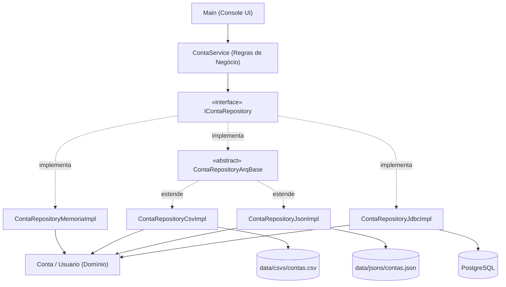

# 🏦 NexusNewBank

> Aplicação bancária de console em Java puro, criada com foco no estudo de **arquitetura de projeto**, **boas práticas** e **evolução incremental** do código.

  

---

## 📋 Índice

- [Sobre o Projeto](#-sobre-o-projeto)
- [Funcionalidades](#-funcionalidades)
- [Arquitetura](#-arquitetura)
  - [Estrutura de Pacotes](#estrutura-de-pacotes)
  - [Diagrama de Dependências](#diagrama-de-dependências)
  - [Camadas da Aplicação](#camadas-da-aplicação)
  - [Estratégias de Persistência](#estratégias-de-persistência)
- [Boas Práticas Aplicadas](#-boas-práticas-aplicadas)
- [Decisões Técnicas](#-decisões-técnicas)
- [Tecnologias](#-tecnologias)
- [Como Executar](#-como-executar)
- [Versões e Branches](#-versões-e-branches)
- [Roadmap — Evolução do Projeto](#-roadmap--evolução-do-projeto)
- [Changelog](#-changelog)

---

## 💡 Sobre o Projeto

O **NexusNewBank** é um sistema bancário simplificado que roda no terminal. O objetivo principal **não** é ser um produto, mas sim servir como **laboratório de estudo** para:

- Praticar arquitetura em camadas (Layered Architecture)
- Aplicar princípios SOLID e boas práticas de OOP
- Retomar fluência em Java após um período sem uso da linguagem
- Explorar diferentes formas de persistência (memória, arquivos e banco de dados relacional)
- Documentar a evolução arquitetural do projeto ao longo do tempo

---

## ✨ Funcionalidades

| Operação         | Descrição                                         |
|------------------|---------------------------------------------------|
| Visualizar Conta | Consulta dados de uma conta pelo CPF              |
| Abrir Conta      | Cria uma nova conta com nome, CPF e saldo inicial |
| Deletar Conta    | Remove uma conta existente pelo CPF               |
| Depósito         | Adiciona saldo a uma conta                        |
| Saque            | Retira saldo de uma conta (com validação)         |
| Transferência    | Transfere valor entre duas contas                 |

Todas as operações são **persistidas** — os dados sobrevivem ao encerramento da aplicação (exceto no modo em memória).

---

## 🏗 Arquitetura

### Estrutura de Pacotes

```
NexusNewBank/
├── data/                                   # Arquivos de dados (persistência em arquivo)
│   ├── csvs/contas.csv
│   └── jsons/contas.json
├── .env                                    # Credenciais do banco (NÃO versionado)
├── pom.xml
└── src/main/java/com/linekerx/
    ├── Main.java                           # Ponto de entrada — UI de console + composição das dependências
    ├── domain/                             # Entidades de domínio (modelo de negócio)
    │   ├── Conta.java                      # Entidade Conta com operações de saldo
    │   └── Usuario.java                    # Record imutável representando o titular
    ├── exception/                          # Exceções customizadas
    │   ├── ContaInexistenteException.java
    │   ├── ContaJaExisteException.java
    │   ├── CpfInvalido.java
    │   ├── SaldoInicialNegativoException.java
    │   ├── SaldoInsuficienteException.java
    │   ├── ValorNegativoException.java
    │   ├── ErroAoCriarArq.java             # Falha ao criar arquivo/diretório de dados
    │   ├── ErroLeituraArq.java             # Falha ao ler arquivo de dados
    │   └── ErroSalvarDados.java            # Falha ao gravar arquivo de dados
    ├── repository/                         # Camada de persistência
    │   ├── IContaRepository.java           # Contrato (abstração) do repositório
    │   ├── ContaRepositoryMemoriaImpl.java # Implementação em memória (HashMap)
    │   ├── ContaRepositoryArqBase.java     # Classe abstrata base para persistência em arquivo
    │   ├── ContaRepositoryCsvImpl.java     # Implementação em CSV
    │   ├── ContaRepositoryJsonImpl.java    # Implementação em JSON (Gson)
    │   └── ContaRepositoryJdbcImpl.java    # Implementação em PostgreSQL (JDBC)
    ├── service/                            # Regras de negócio e orquestração
    │   └── ContaService.java
    └── utils/                              # Utilitários de formatação
        ├── FormatCpf.java
        ├── FormatInput.java
        └── FormatSaldo.java
```

### Diagrama de Dependências



> `exception/` e `utils/` são pacotes **transversais**, utilizados por várias camadas.

### Camadas da Aplicação

| Camada           | Pacote        | Responsabilidade                                                                         |
|------------------|---------------|------------------------------------------------------------------------------------------|
| **Apresentação** | `Main`        | Interação com o usuário via console e escolha da implementação de repositório.           |
| **Serviço**      | `service`     | Validações de negócio e orquestração. Depende **apenas** de `IContaRepository`.          |
| **Repositório**  | `repository`  | Contrato + implementações de armazenamento (memória, CSV, JSON, PostgreSQL).             |
| **Domínio**      | `domain`      | Entidades puras com comportamento próprio (ex: `Conta.depositar()`, `Conta.sacar()`).    |
| **Exceções**     | `exception`   | Exceções semânticas de negócio e de infraestrutura (I/O de arquivos).                    |
| **Utilitários**  | `utils`       | Funções auxiliares de formatação (CPF, saldo, entrada do console).                       |

### Estratégias de Persistência

Todas as implementações seguem o mesmo contrato:

```java
public interface IContaRepository {
    void salvarConta(Conta conta);
    void removerConta(String cpf);
    Conta buscarPorCpf(String cpf);
    boolean existeContaParaCpf(String cpf);
}
```

| Implementação                | Armazenamento             | Características                                                                                   |
|------------------------------|---------------------------|---------------------------------------------------------------------------------------------------|
| `ContaRepositoryMemoriaImpl` | `HashMap`                 | Volátil — dados perdidos ao encerrar. Útil para testes/estudo.                                     |
| `ContaRepositoryCsvImpl`     | `data/csvs/contas.csv`    | Cabeçalho `CPF;Nome;Saldo`. Aceita `;` ou `,` como separador na leitura.                           |
| `ContaRepositoryJsonImpl`    | `data/jsons/contas.json`  | Serialização com **Gson** (pretty printing), mapa indexado por CPF.                                |
| `ContaRepositoryJdbcImpl`    | PostgreSQL                | JDBC puro com `PreparedStatement`, *upsert* via `ON CONFLICT`, credenciais lidas do `.env`. **(padrão)** |

As implementações em arquivo compartilham a lógica comum na classe abstrata `ContaRepositoryArqBase` (padrão **Template Method**): ela mantém um cache em memória (`Map<String, Conta>`) e delega às subclasses apenas o que muda — `criarDirArq()`, `carregarContas()` e `salvarDados()`. Arquivos e diretórios são criados automaticamente caso não existam.

Para trocar a estratégia de persistência, basta alterar **uma linha** em `Main.inicializar()`:

```java
contaRepository = new ContaRepositoryJdbcImpl();     // PostgreSQL (padrão)
// contaRepository = new ContaRepositoryJsonImpl();  // JSON
// contaRepository = new ContaRepositoryCsvImpl();   // CSV
// contaRepository = new ContaRepositoryMemoriaImpl(); // Memória
```

---

## ✅ Boas Práticas Aplicadas

### 1. Separação de Responsabilidades (SRP)
Cada classe tem **uma única razão para mudar**:
- `Conta` → gerencia saldo
- `ContaService` → valida regras de negócio
- `IContaRepository` e implementações → armazenam/recuperam dados
- `Main` → interface com o usuário e montagem das dependências

### 2. Inversão de Dependência (DIP) — *novo na v2.0*
`ContaService` deixou de depender de uma classe concreta e passou a depender do **contrato** `IContaRepository`. Com isso, a regra de negócio não sabe (nem precisa saber) se os dados estão em memória, arquivo ou banco de dados.

```java
public ContaService(IContaRepository contaRepository) {
    this.contaRepository = contaRepository;
}
```

### 3. Aberto/Fechado (OCP) e Substituição de Liskov (LSP) — *novo na v2.0*
Novas formas de persistência são adicionadas **criando novas classes**, sem alterar o `ContaService`. Qualquer implementação de `IContaRepository` pode substituir outra sem quebrar o comportamento da aplicação.

### 4. Template Method para Reuso — *novo na v2.0*
`ContaRepositoryArqBase` centraliza o fluxo comum de persistência em arquivo, evitando duplicação entre CSV e JSON.

### 5. Exceções Semânticas e Específicas
Em vez de lançar `RuntimeException` genérica ou usar códigos de erro, o projeto define **exceções nomeadas**:

**Negócio**
- `ContaInexistenteException` — conta não encontrada
- `ContaJaExisteException` — CPF já cadastrado
- `CpfInvalido` — CPF fora do formato esperado
- `SaldoInsuficienteException` — saque superior ao saldo
- `SaldoInicialNegativoException` — abertura de conta com saldo negativo
- `ValorNegativoException` — depósito/saque/transferência com valor ≤ 0

**Infraestrutura (arquivos)** — *novo na v2.0*
- `ErroAoCriarArq` — falha ao criar arquivo/diretório de dados
- `ErroLeituraArq` — falha ao ler o arquivo de dados
- `ErroSalvarDados` — falha ao gravar o arquivo de dados

As exceções de I/O preservam a **causa original** (`IOException`), facilitando o diagnóstico.

### 6. Segurança no Acesso ao Banco — *novo na v2.0*
- Uso de `PreparedStatement` com parâmetros, prevenindo **SQL Injection**
- `try-with-resources` garantindo o fechamento de `Connection`, `PreparedStatement` e `ResultSet`
- Credenciais fora do código-fonte, em um arquivo `.env` **ignorado pelo Git**

### 7. Imutabilidade com Records
`Usuario` é declarado como `record`, tornando-o **imutável** por padrão — ideal para value objects.

```java
public record Usuario(String nome, String cpf) { }
```

### 8. Uso de `BigDecimal` para Valores Monetários
O projeto **evita `double`/`float`** para representar dinheiro, usando `BigDecimal` (inclusive no JDBC, via `setBigDecimal`/`getBigDecimal`).

### 9. Encapsulamento de Comportamento no Domínio (Rich Domain)
As operações de `depositar()` e `sacar()` vivem **dentro** da classe `Conta`, não no serviço — evitando o antipattern *Anemic Domain*.

### 10. Fluxo de Exceções com try-catch-finally
A `Main` trata exceções por operação, com blocos `finally` para manter a UX consistente (pausa antes de voltar ao menu). Falhas na inicialização do repositório encerram a aplicação com mensagem clara.

### 11. Validação Defensiva
Todas as operações validam entradas **antes** de executar:
- CPF com 11 dígitos
- Saldo inicial ≥ 0
- Valores de operação > 0
- Existência da conta antes de operar

---

## 🔧 Decisões Técnicas

| Decisão                           | Justificativa                                                                          |
|-----------------------------------|----------------------------------------------------------------------------------------|
| Java 25                           | Uso da versão mais recente para aproveitar recursos modernos da linguagem              |
| Maven                             | Gerenciamento de build e dependências padrão do ecossistema Java                       |
| Interface `IContaRepository`      | Desacoplar o serviço da forma de armazenamento (DIP)                                   |
| CSV e JSON antes do banco         | Evolução incremental: entender persistência "na mão" antes de usar um SGBD             |
| Gson                              | Biblioteca leve e simples para (de)serialização JSON                                   |
| JDBC puro (sem JPA/Hibernate)     | Entender os fundamentos de acesso a banco antes de adotar um ORM                       |
| PostgreSQL                        | Banco relacional robusto e amplamente usado; suporte a *upsert* com `ON CONFLICT`      |
| `dotenv-java`                     | Manter credenciais fora do código e do repositório                                     |
| `RuntimeException` como base      | Exceções não-checadas para evitar poluição de assinaturas de métodos                   |
| Console como interface            | Foco na lógica de negócio, sem overhead de frameworks web                              |
| Sem frameworks (Spring, etc.)     | Estudo de fundamentos sem "magia" — inversão de controle manual                        |

---

## 🛠 Tecnologias

- **Java 25**
- **Maven** (build e dependências)
- **PostgreSQL** + **JDBC** (`org.postgresql:postgresql:42.7.2`)
- **Gson** (`com.google.code.gson:gson:2.10.1`)
- **dotenv-java** (`io.github.cdimascio:dotenv-java:3.0.0`)
- **Nenhum framework** — Java puro

---

## 🚀 Como Executar

### Pré-requisitos
- [JDK 25+](https://jdk.java.net/25/)
- [Maven 3.9+](https://maven.apache.org/download.cgi)
- [PostgreSQL](https://www.postgresql.org/download/) — apenas se for usar a implementação JDBC (padrão)

### 1. Preparar o banco de dados (modo JDBC)

Crie um banco e a tabela `contas`:

```sql
CREATE TABLE contas (
    cpf   VARCHAR(11)    PRIMARY KEY,
    nome  VARCHAR(255)   NOT NULL,
    saldo NUMERIC(15, 2) NOT NULL
);
```

### 2. Configurar o `.env`

Crie um arquivo `.env` na **raiz do projeto**:

```env
DB_URL=jdbc:postgresql://localhost:5432/nexusnewbank
DB_USERNAME=seu_usuario
DB_PASSWORD=sua_senha
```

> [!IMPORTANT]
> O `.env` está no `.gitignore` e **nunca** deve ser commitado.

> [!TIP]
> Se não quiser configurar um banco, troque a implementação em `Main.inicializar()` para `ContaRepositoryJsonImpl`, `ContaRepositoryCsvImpl` ou `ContaRepositoryMemoriaImpl`.

### 3. Compilar e executar

```bash
# Compilar o projeto (baixa as dependências)
mvn compile

# Executar a aplicação
mvn exec:java -Dexec.mainClass="com.linekerx.Main"
```

> Execute os comandos a partir da raiz do projeto, pois os caminhos `data/...` e o `.env` são relativos ao diretório de execução.

---

## 🌿 Versões e Branches

Cada versão estável é congelada em uma branch própria e marcada com uma tag. A `main` segue com o desenvolvimento contínuo.

| Versão   | Branch     | Tag    | Resumo                                                     |
|----------|------------|--------|------------------------------------------------------------|
| **v1.0** | `version1` | `v1.0` | Estrutura base em camadas com repositório em memória       |
| **v2.0** | `version2` | `v2.0` | Abstração do repositório + persistência em CSV, JSON e PostgreSQL |
| *next*   | `main`     | —      | Desenvolvimento em andamento                               |

---

## 🗺 Roadmap — Evolução do Projeto

O projeto é evoluído de forma incremental. Cada etapa representa um aprendizado arquitetural:

- [x] **v1.0** — Estrutura base com camadas (domain, service, repository, exception, utils)
- [x] **v2.0** — Interface para `Repository` (programar para abstrações) + persistência em arquivo (CSV/JSON) e banco de dados (PostgreSQL via JDBC)
- [ ] **v2.1** — Testes unitários com JUnit 5 + Mockito
- [ ] **v2.2** — Seleção da implementação de repositório por configuração (sem alterar código)
- [ ] **v3.0** — Migração para API REST com Spring Boot
- [ ] **v3.1** — Persistência com Spring Data JPA (H2 / PostgreSQL)
- [ ] **v3.2** — DTOs, validação com Bean Validation e tratamento global de erros
- [ ] **v4.0** — Autenticação e autorização (Spring Security)
- [ ] **v4.1** — Docker + Docker Compose
- [ ] **v4.2** — CI/CD com GitHub Actions

> 💡 Cada etapa será documentada aqui e registrada em branches/tags no repositório.

---

## 📓 Changelog

### v2.0 — Persistência (Outubro 2026)
- ✅ Projeto renomeado para **NexusNewBank**
- ✅ Interface `IContaRepository` — `ContaService` passa a depender de abstração (DIP)
- ✅ `ContaRepository` renomeado para `ContaRepositoryMemoriaImpl`
- ✅ Classe abstrata `ContaRepositoryArqBase` com lógica comum para persistência em arquivo
- ✅ Persistência em **CSV** (`ContaRepositoryCsvImpl`)
- ✅ Persistência em **JSON** com Gson (`ContaRepositoryJsonImpl`)
- ✅ Persistência em **PostgreSQL** via JDBC (`ContaRepositoryJdbcImpl`) com *upsert* (`ON CONFLICT`)
- ✅ Configuração de credenciais via `.env` (`dotenv-java`) e `.env` adicionado ao `.gitignore`
- ✅ Novas exceções de infraestrutura: `ErroAoCriarArq`, `ErroLeituraArq`, `ErroSalvarDados`
- ✅ Criação automática de diretórios/arquivos de dados
- ✅ Tratamento de falhas de inicialização na `Main`

### v1.0 — Fundação (Agosto 2026)
- ✅ Estrutura de pacotes em camadas
- ✅ Entidades de domínio (`Conta`, `Usuario` como record)
- ✅ Exceções de negócio customizadas (6 tipos)
- ✅ Repository in-memory com `HashMap`
- ✅ Service com regras de negócio e validações
- ✅ Interface de console com menu interativo
- ✅ Utilitários de formatação (CPF, saldo, input)
- ✅ `BigDecimal` para valores monetários
- ✅ Injeção de dependência manual via construtor

---

## 📄 Licença

Este projeto é de uso pessoal e educacional.

---

<p align="center">
  Feito por <strong>Gabriel Lineker</strong>
</p>
